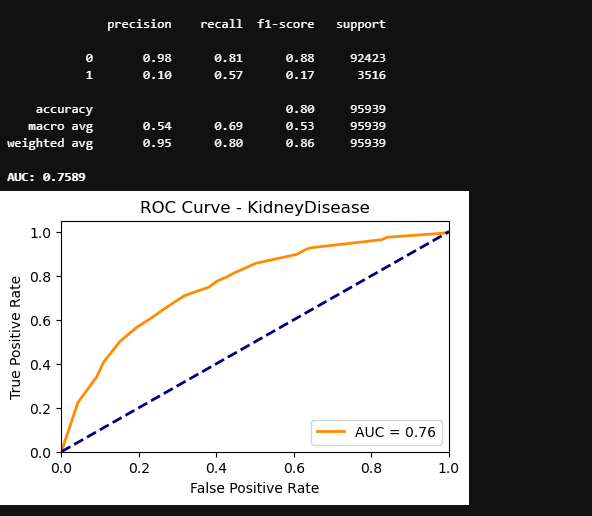

# Disease Prediction Models
In this project, I used the dataset hearts_2020_cleaned.csv to build Logistic Regression and Decision Tree models that predict whether an individual has heart disease, kidney disease, or skin cancer based on various health and lifestyle features.

## Dataset Features
The dataset includes the following columns:
- HeartDisease 
- BMI
- Smoking
- AlcoholDrinking
- Stroke
- PhysicalHealth
- MentalHealth
- DiffWalking
- Sex
- AgeCategory
- Race
- Diabetic
- PhysicalActivity
- GenHealth
- SleepTime
- Asthma
- KidneyDisease
- SkinCancer

## Data Preparation:
1. Binary Encoding: Columns with "Yes"/"No" values were converted to binary (1/0) using **LabelEncoder**:
```
from sklearn.preprocessing import LabelEncoder

cols = ['HeartDisease', 'Smoking', 'AlcoholDrinking', 'Stroke', 'DiffWalking', 'Sex', 'PhysicalActivity',
       'Asthma', 'KidneyDisease', 'SkinCancer']

for col in cols:
    encoder = LabelEncoder()
    df[col] = encoder.fit_transform(df[[col]])
```
2. Ordinal Encoding: The **GenHealth** column was encoded to reflect the order of ratings:
```
from sklearn.preprocessing import OrdinalEncoder

rating = ['Poor', 'Fair', "Excellent", "Good", "Very good"]
ordinal_encoder = OrdinalEncoder(categories=[rating])
df["GenHealth"] = ordinal_encoder.fit_transform(df[['GenHealth']])
```
3. One-Hot Encoding: Remaining categorical columns were encoded using one-hot encoding:

```
df = pd.get_dummies(df,columns=['AgeCategory', 'Race', 'Diabetic'], drop_first=True,dtype=int)
```
After preprocessing, the final dataset contained 35 features.

## Logistic Regression
Three separate logistic regression models were built for each of the three diseases:

### Heart Disease


### Kidney Disease


### Skin Cancer


Across all three models, there was no sign of overfitting, as training and testing accuracies were consistently similar. The logistic regression models demonstrated relatively high recall scores, indicating strong performance in identifying positive cases. Notably, the skin cancer model achieved a **recall of 0.83**, meaning it **correctly identified 83% of individuals who actually had skin cancer**.

However, precision was low across all models, suggesting that a significant number of the positive predictions were incorrect. As a result, the F1-scores ranged between 0.15 and 0.35, reflecting an imbalance between precision and recall. Among the three models, the **heart disease model achieved the highest AUC**, indicating it had the best overall ability to distinguish between classes.

The imbalance between recall and precision may be due to the class imbalance in the dataset. This is expected, as the majority of individuals do not have heart disease, kidney disease, or skin cancer. To address this issue, sampling techniques such as **SMOTE, ADASYN, RandomOverSampler, and RandomUnderSampler** can be applied. However, it’s important to note that using these techniques can increase the risk of overfitting.


## Decision Trees 
Decision Tree classifiers were also trained to predict the same three conditions. Below are their evaluation results:

### Heart Disease


### Kidney Disease



### Skin Cancer


Talk about results here....
